# 3D_CPP_magnet — 磁石・電気・電流まで入れた C++ の剛体物理エンジン

剛体の衝突から始めて、永久磁石と鉄、電荷と導体、電流の導線とコイルまでを **1 つの物理エンジン**（`src/phys`、raylib に依存しない）に入れ、
それを raylib で見せるデモ（21 のシーン）と、磁力で飛び回るゲーム **MAGNET FLOW**、そして理論値と突き合わせるヘッドレスのテスト（約 80 項目）を作りました。
力は毎ステップ源から直接計算し（場の格子は持たない）、作用・反作用で返すので、運動量とエネルギーがテストで追えます。

<table>
<tr>
<td align="center">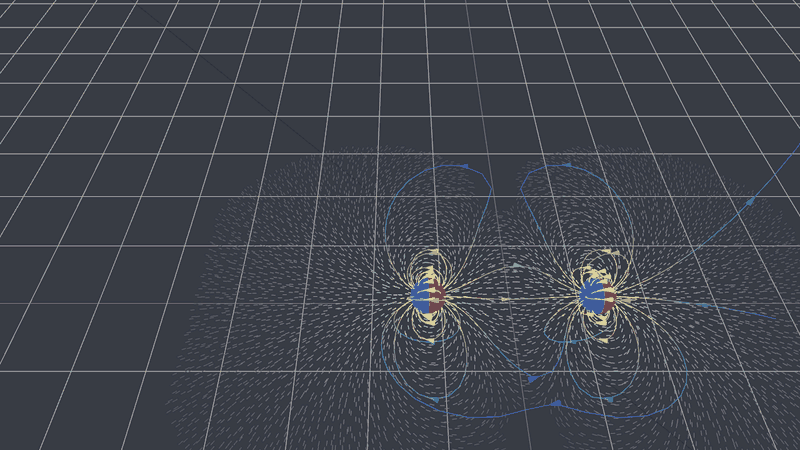<br>磁石と鉄の磁力線（線 1 本 = 一定の磁束）</td>
<td align="center">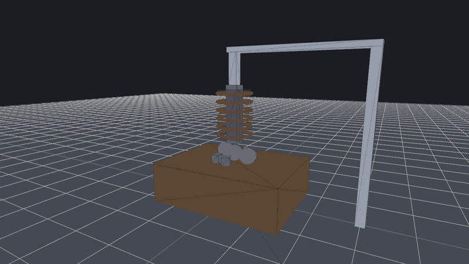<br>電磁石: コイルの場で鉄の芯が磁化し、下の鉄を持ち上げる</td>
</tr>
<tr>
<td align="center">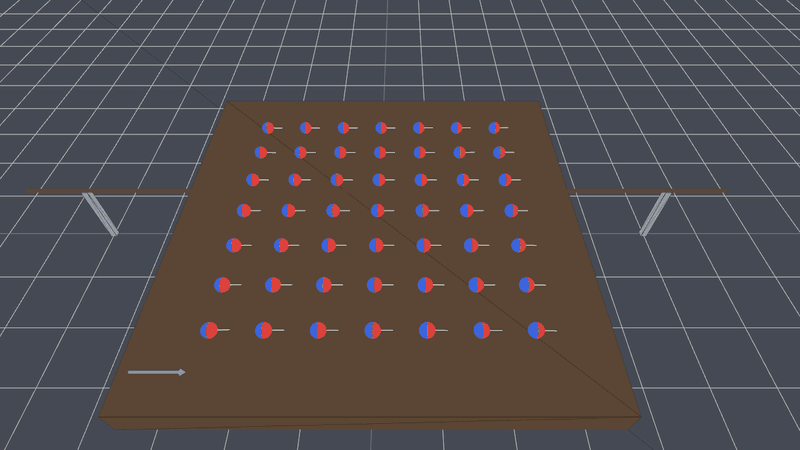<br>エルステッドの実験: 電流を入れると方位磁針が一斉に回る</td>
<td align="center">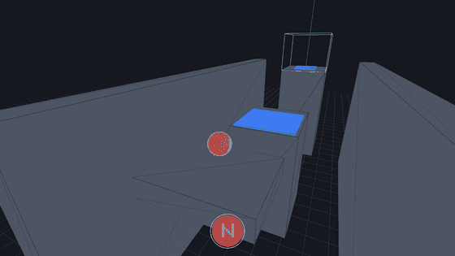<br>MAGNET FLOW: 自分が磁石になって、吸着と反発で飛ぶ</td>
</tr>
</table>

---

## 目次

1. [何が入っているか](#1-何が入っているか)
2. [電磁気のシーン（アニメーション）](#2-電磁気のシーンアニメーション)
3. [MAGNET FLOW（ゲーム）](#3-magnet-flowゲーム)
4. [システム構成](#4-システム構成)
5. [物理モデルの要点](#5-物理モデルの要点)
6. [検証（テスト）](#6-検証テスト)
7. [ビルドと実行](#7-ビルドと実行)
8. [操作](#8-操作)
9. [ドキュメント](#9-ドキュメント)
10. [限界と、次にやりたいこと](#10-限界と次にやりたいこと)

---

## 1. 何が入っているか

| 実行ファイル | 中身 | 依存 |
|---|---|---|
| `demo` | 物理エンジンをそのまま見せる 21 のシーン。剛体 4、磁石 9、電気 4、電流 4（F12 はコイルガンのシューティング） | raylib |
| `magnet_flow` | 3D 磁気アクションパズルのプロトタイプ。12 ステージ（チュートリアル、3 つの本ステージ、9 区間の GRAND TOUR、新ギミック 4 つ） | raylib |
| `core_test` `magnet_test` `electric_test` `current_test` `flow_test` | 理論値・保存則・回帰との比較。raylib 不要 | なし |

物理エンジン本体は `src/phys` の約 3000 行で、raylib を含みません。

---

## 2. 電磁気のシーン（アニメーション）

GIF は `tools/make_gifs.py` がデモを自動操作して撮ったものです（HUD は消してあります）。

### 磁石と鉄（`MagnetSystem`）

本物の直径 5 mm のネオジム球（接触したときの引力が重さの 779 倍）を 100 倍に拡大し、重力はそのままなので時間が √100 = 10 倍に伸びます。デモは実時間に合わせて 10 倍速で回しています。

| | |
|---|---|
| 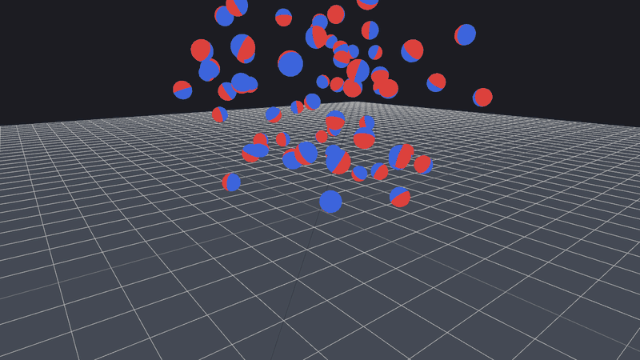<br>**5 磁石球**: 落とすと向きを揃えて鎖や輪になる | 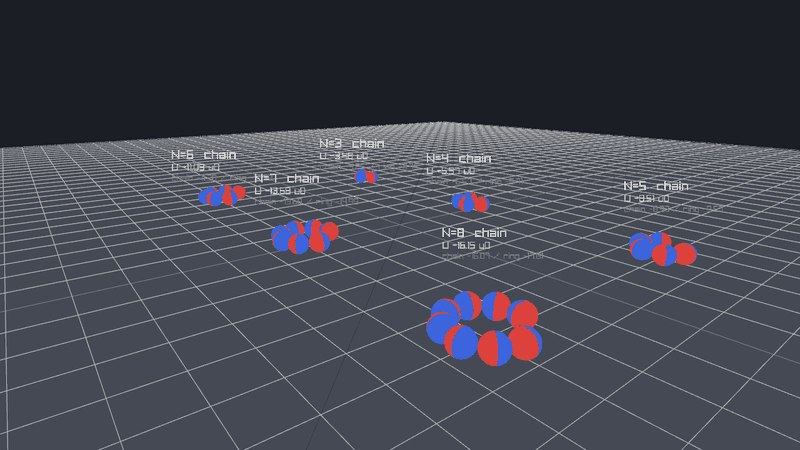<br>**6 鎖か輪か**: 弧が閉じて輪になる。構造の種類を自動で数える |
| 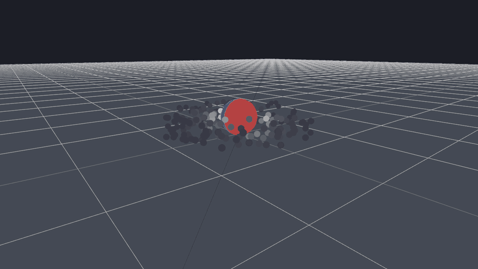<br>**7 砂鉄**: 磁化率と飽和をもつ小さな鉄の粒が、磁石のまわりに模様を作る | 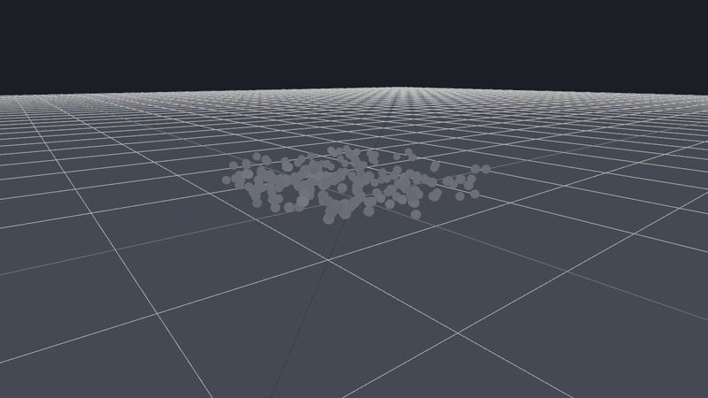<br>**7 一様な外部磁場**: 砂鉄が場の向きに並ぶ（E キー） |
| 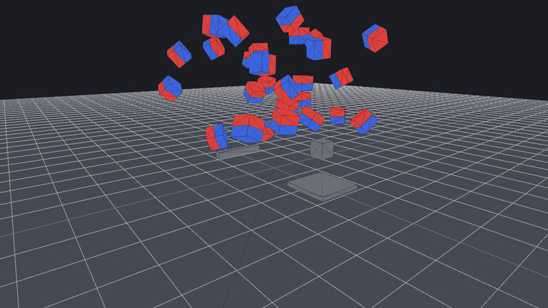<br>**8 立方体の磁石と鉄**: 箱の磁石は 8 点の双極子で近距離の力とトルクを出す | 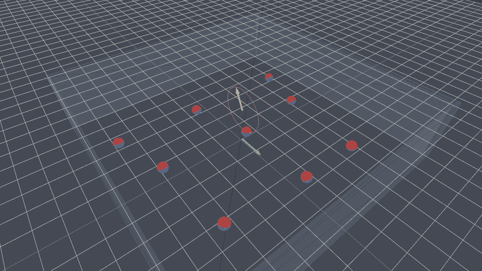<br>**A 磁気ローラー**: 回転する外部磁場で磁石が転がる |
| 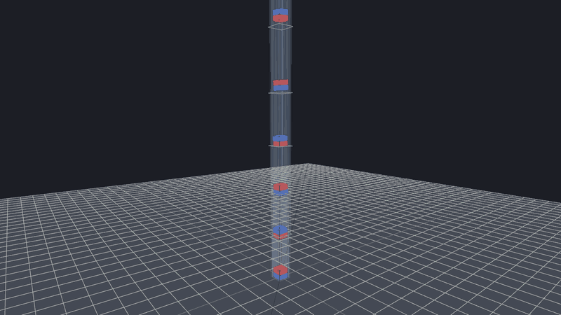<br>**B 浮かぶ磁石の塔**: 反発する磁石が筒の中で浮く。すき間を理論値と比べる | 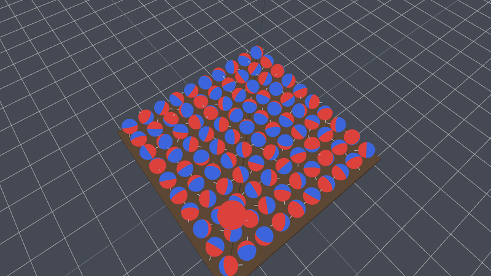<br>**C 方位磁針の群れ**: 位置を固定した磁石の格子が互いの場で縞や渦になる |
| 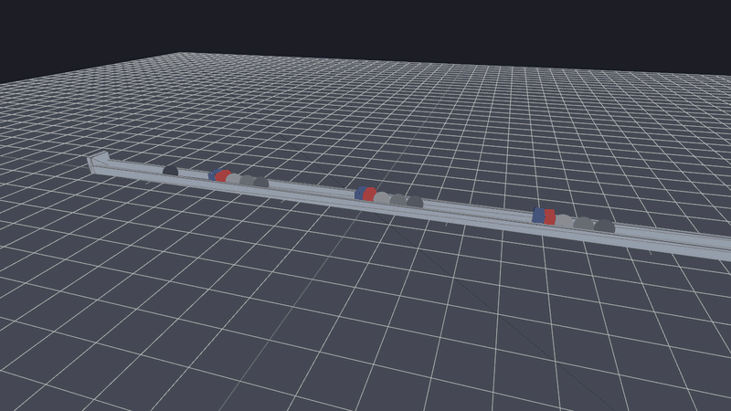<br>**D ガウス加速器**: 磁石と鉄球の段に球を当てると、段ごとに速い球が飛び出す | 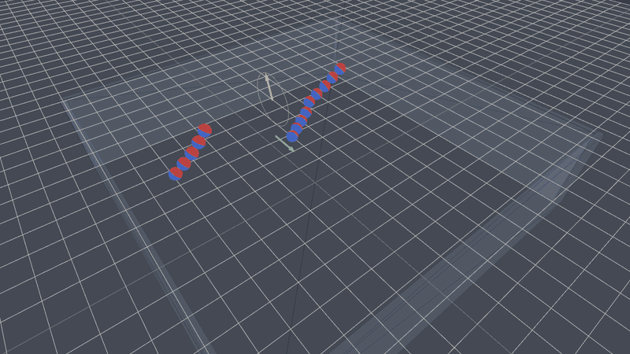<br>**磁石の鎖が転がる**（A の別配置） |

### 電気（`ElectricSystem`）

| | |
|---|---|
| 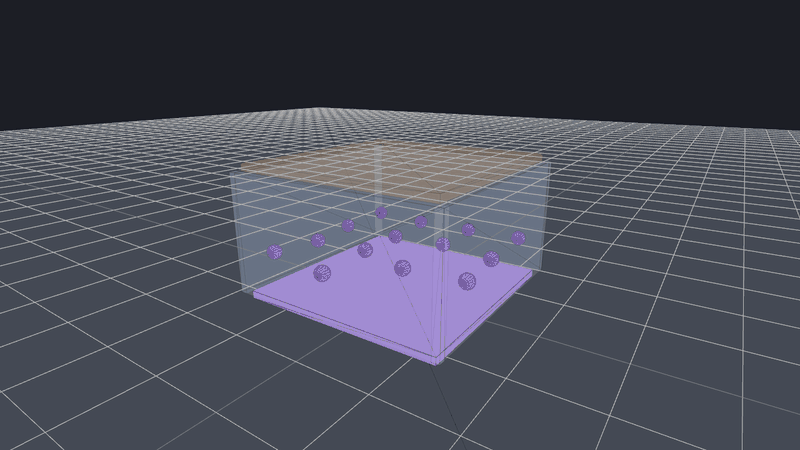<br>**F5 電気ベル**: 平行板の間で導体の小球が跳ね回る。触れるたびに電荷が入れ替わる | 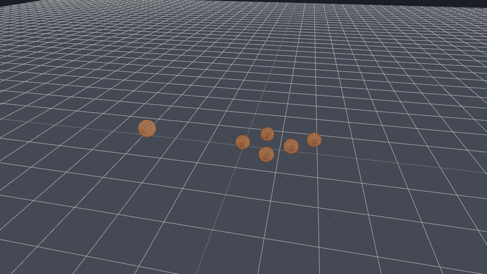<br>**F5 電荷の分け合い**: 帯電した球が帯電していない球を引き寄せ（誘導）、触れると分け合って弾き合う |
| 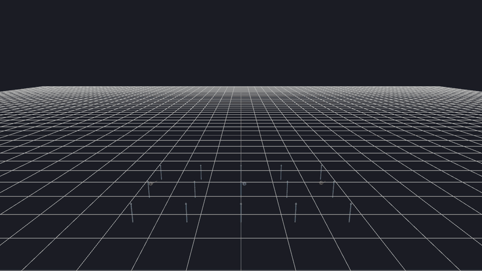<br>**F6 磁場の中の荷電粒子**: ローレンツ力でらせんを描く（Boris 法で回転） | 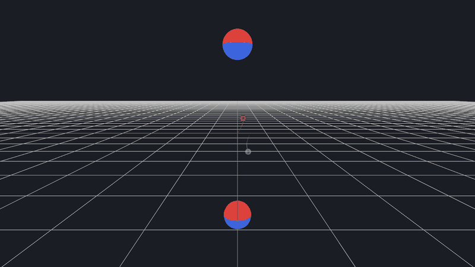<br>**F6 磁気瓶**: 2 つの磁石の間で跳ね返り続ける |
| 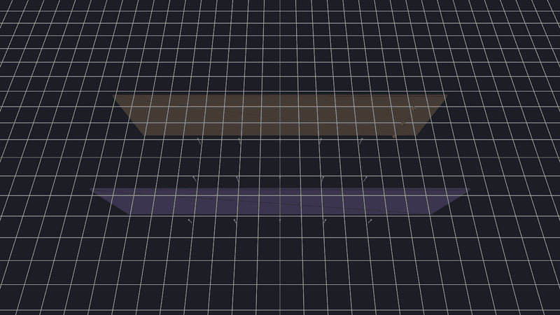<br>**F6 E×B ドリフト** | 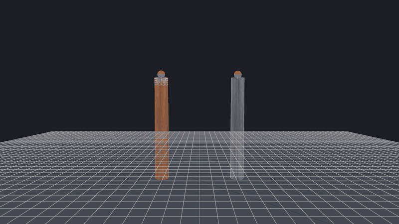<br>**F7 渦電流**: 銅の管の中では磁石がゆっくり落ちる（プラスチックの管と競争） |
| 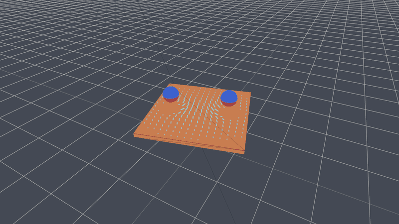<br>**F7 アラゴの円板**: 磁石を回すと、下の銅の円板がつられて回る | 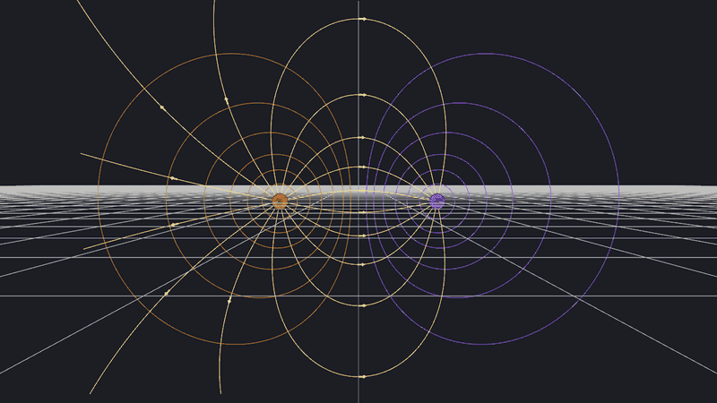<br>**F8 電気力線と等電位線**: 点電荷、平行板、導体の誘導 |

### 電流（`CurrentSystem`、ビオ・サバール）

| | |
|---|---|
| <br>**F9 エルステッド**: 直線の電流の下の方位磁針が回る（理論 55.7°、実測 57.7°） | 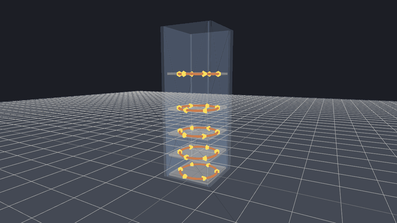<br>**F9 輪の塔**: 電流の向きが交互の輪が反発で浮き、切ると落ち、同じ向きにすると重なる |
| <br>**F10 電磁石**: 鉄の芯に巻いたソレノイド。磁束が芯に集まって極から出る | 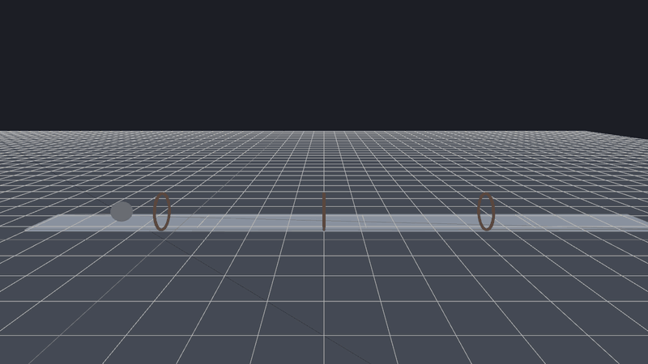<br>**F10 コイルガン**: 球が近づくあいだだけ ON にするコイル 3 段。11 → 15 → 18 m/s（理論と 1% 以内） |
| 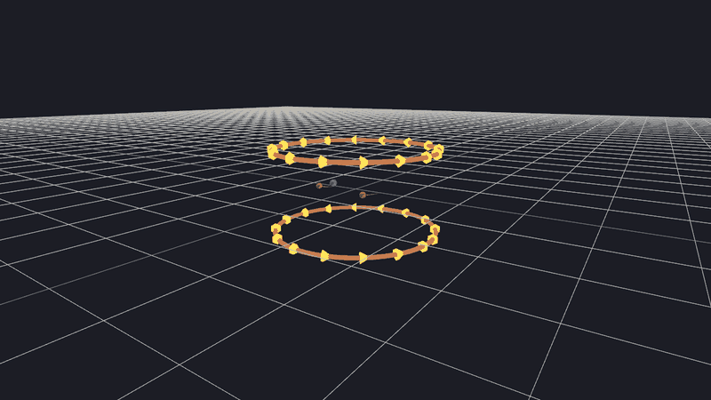<br>**F11 ヘルムホルツコイル**: 一様な場の中の円運動、磁気瓶（ロスコーン）、カスプ | 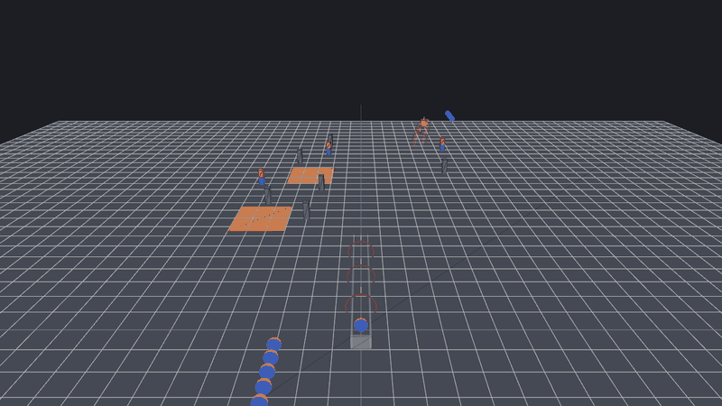<br>**F12 コイル砲台**: 段を切るタイミングが火力。同じコイルを「中心で入れる」と、向かってくる弾を受け止める |

---

## 3. MAGNET FLOW（ゲーム）

プレイヤー自身が磁石になり、ステージの磁石・鉄との吸着と反発だけで 3D 空間を飛び回ります。操作は実質 1 ボタン（極性の切り替え）。
「今ここで切り替えれば次の磁石へ飛べる」というギリギリの判断と、自分の動きで環境の磁石が連鎖して動く驚きを狙っています。

| | |
|---|---|
| 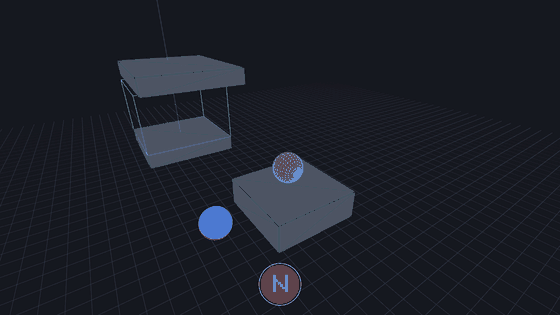<br>**P2 タイミング**: 切り替える瞬間で飛ぶ先が変わる | 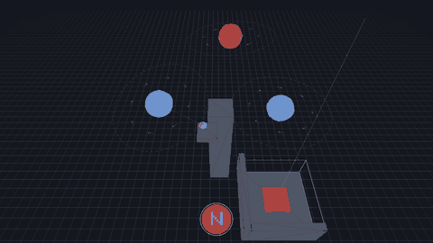<br>**02 軌道庭園**: 磁石のまわりを周回して速度を稼ぐ |
| 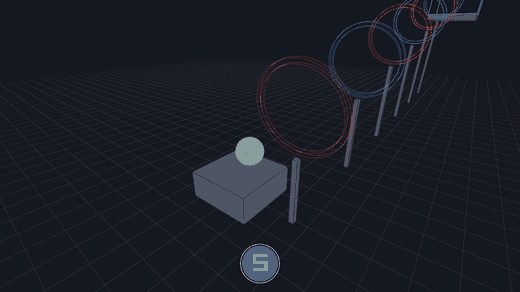<br>**L2 ガウス加速リング**: 鉄球の列を叩いて自分を射出する | 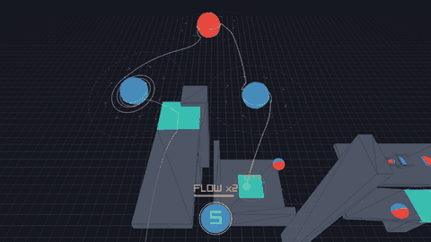<br>**GRAND TOUR 磁気レンズ**: 力場で道を曲げる |

最高記録（時間、切り替え回数、最大速度、入力、軌跡）は実行ファイルの隣の `magnet_flow_records.txt` に保存し、ゴースト（最高記録の走り）とリプレイが見られます。
仕様は [magnetic_flow_spec.md](magnetic_flow_spec.md) と [magnetic_flow_gimmick_stage_spec.md](magnetic_flow_gimmick_stage_spec.md)。

---

## 4. システム構成

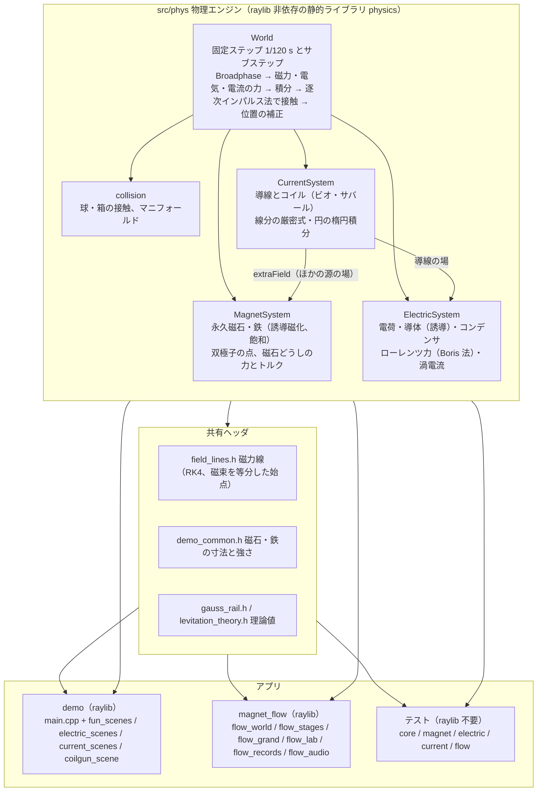
```mermaid
flowchart TB
    subgraph phys["src/phys  物理エンジン（raylib 非依存の静的ライブラリ physics）"]
        direction TB
        W["World<br>固定ステップ 1/120 s とサブステップ<br>Broadphase → 磁力・電気・電流の力 → 積分 → 逐次インパルス法で接触 → 位置の補正"]
        C["collision<br>球・箱の接触、マニフォールド"]
        M["MagnetSystem<br>永久磁石・鉄（誘導磁化、飽和）<br>双極子の点、磁石どうしの力とトルク"]
        E["ElectricSystem<br>電荷・導体（誘導）・コンデンサ<br>ローレンツ力（Boris 法）・渦電流"]
        I["CurrentSystem<br>導線とコイル（ビオ・サバール）<br>線分の厳密式・円の楕円積分"]
        W --> C
        W --> M
        W --> E
        W --> I
        I -- "extraField（ほかの源の場）" --> M
        I -- "導線の場" --> E
    end
    subgraph shared["共有ヘッダ"]
        FL["field_lines.h 磁力線（RK4、磁束を等分した始点）"]
        DC["demo_common.h 磁石・鉄の寸法と強さ"]
        GR["gauss_rail.h / levitation_theory.h 理論値"]
    end
    subgraph apps["アプリ"]
        D["demo（raylib）<br>main.cpp + fun_scenes / electric_scenes / current_scenes / coilgun_scene"]
        F["magnet_flow（raylib）<br>flow_world / flow_stages / flow_grand / flow_lab / flow_records / flow_audio"]
        T["テスト（raylib 不要）<br>core / magnet / electric / current / flow"]
    end
    phys --> shared
    shared --> D
    shared --> F
    shared --> T
    phys --> D
    phys --> F
    phys --> T
```

### ディレクトリ

| 場所 | 内容 |
|---|---|
| `src/phys/` | エンジン本体。`math3d.h`（Vec3 / Quat / Mat3）、`body.h`（剛体）、`collision.*`、`world.*`、`magnet.*`、`electric.*`、`current.*` |
| `src/main.cpp` | デモ本体。描画、カメラ、HUD、シーンの切り替え、磁力線の表示 |
| `src/fun_scenes.*` `electric_scenes.*` `current_scenes.*` `coilgun_scene.*` | デモのシーン。`FunScene` インターフェース（組み立て、毎ステップの更新、キー入力、追加の描画、HUD の行）を実装する |
| `src/field_lines.h` | 磁力線と電気力線のたどり（デモとゲームで共有） |
| `src/flow/` | MAGNET FLOW。`flow_world`（プレイヤーの磁石とギミック）、`flow_stages`（ステージ定義）、`flow_grand`（GRAND TOUR）、`flow_lab`（L1〜L4）、`flow_records`（記録とリプレイ）、`flow_audio` |
| `tests/` | ヘッドレスのテスト。`ctest` で全部走る |
| `tools/` | GIF の自動撮影（`make_gifs.py`、`make_flow_gifs.py`）、理論値の計算（`reference_values.py`、`cube_reference.py`） |
| `media/` | README とドキュメントの GIF |
| `*.md` | 仕様と実装メモ（[9. ドキュメント](#9-ドキュメント)） |

### 毎ステップの流れ（`World::step`）

```
for each substep (h = dt / substeps):
    currents.prepare()                     # 導線の頂点を世界座標に
    magnets.applyForces()                  # 磁石・鉄の点の場（導線の場も足す）→ 力とトルク
    currents.applyForces(magnets)          # 磁性体 ↔ 導線、導線 ↔ 導線、外部磁場 ↔ 導線（作用・反作用）
    electric.applyForces(magnets, h)       # クーロン、誘導、コンデンサ、渦電流
    integrateForces(h)                     # 速度の更新（静的な物体は kinematic 速度）
    electric.rotateLorentz(magnets, h)     # 磁場の中の電荷は速度を回す（Boris 法。エネルギーを変えない）
    broadphase + narrowphase               # 接触のマニフォールド
    solve contacts (sequential impulses)   # 反発・摩擦・転がり摩擦
    integrate positions, pinned bodies     # 位置と向き、固定した物体を戻す
```

---

## 5. 物理モデルの要点

**単位** — 磁気は K = μ0/4π = 1、電気は k = 1/4πε0 = 1 の単位系で、長さ・質量・時間はシーンごとに「本物の cm を 1 単位」（磁石のデモ）か「m と実時間」（電気・電流のデモ）。

**剛体** — 球と箱。固定タイムステップ 1/120 s、逐次インパルス法（反発、クーロン摩擦、転がり摩擦、位置の補正）。静的な物体は手で動かせる（kinematic）。

**磁石と鉄**（[MAGNET_SPEC.md](MAGNET_SPEC.md)）
- 永久磁石の球は 1 点の双極子、箱は 8 点。鉄は磁化率 χ と飽和磁化をもつ軟磁性体で、置かれた場から誘導モーメントを反復（ヤコビ法）で解く。
- 力は双極子どうしの厳密な式（遠くは重心、近くは点ごと）。近づきすぎたときの発散はクランプ。磁石の鎖や輪を構造として検出する。
- 一様な外部磁場（スイッチ可）と、ほかの源の場を足す口 `extraField`。

**電気**（[ELECTRIC_SPEC.md](ELECTRIC_SPEC.md)）
- 点電荷のクーロン力、導体の球の鏡像誘導（遠くで 2R³q²/d⁵）、触れた導体の電荷の分け合い、平行板コンデンサ。
- ローレンツ力は Boris 法で速度を回す（運動エネルギーを変えない）。
- 渦電流は導体の面に置いた点で、動く磁石の場 v × B から電流を見積もって磁石に抵抗力を返す（銅の管の終端速度を合わせる σ の式つき）。

**電流**（[CURRENT_SPEC.md](CURRENT_SPEC.md)）
- 導線は折れ線か円。線分は Hanson–Hirshman の厳密式（double）、円は完全楕円積分（AGM、約 150 ns/点）。
- 磁石とコイルの力は ∇(m·B) の中心差分で、コイル側には −F と角運動量が保存するトルクを返す。導線どうしはガウス求積。
- 電流は決めた値（スイッチと強さは毎ステップ変えられる）。誘導で変わる電流はまだない。

**磁力線** — 各点の B を源から直接求めて RK4 でたどる。始点は磁石の表面（またはコイルの面）の磁束を等分した点なので、**線 1 本 = 一定の磁束**、線の混み具合が |B| を表す。

---

## 6. 検証（テスト）

全部ヘッドレス（raylib 不要）で、`ctest` で走ります。理論値との差と保存則を見ています。

| テスト | 項目 | 見ているもの（例） |
|---|---|---|
| `core_test` | 13 | 自由落下、静止、5 段と 14 段の積み上げが立つ、反発が減衰する、摩擦で止まる（摩擦 0 なら止まらない）、転がり摩擦、角運動量の保存、60 個の球の山が落ち着く |
| `magnet_test` | 23 | 双極子の力 = −∇U と Γ、運動量と角運動量、エネルギー（接触前の誤差 ∝ h、注入なし）、鎖と輪のエネルギー、誘導モーメントの収束と力の整合、立方体どうしの力 vs 厳密解（3% 以内）、一様な場のトルクと誘導、浮かぶ塔のすき間（理論と 1% 以内）、回転する場で転がる、ガウス加速器、双極子の磁力線 r = L sin²θ |
| `electric_test` | 11（E1〜E11） | クーロン力と −dU/dr、導体の誘導 2R³q²/d⁵、接触で電荷を分け合う（容量の比、保存）、電気ベル、一様な磁場の円運動（速さ不変、周期と半径）、E×B ドリフト、磁気瓶、銅の管の終端速度（σ に反比例）、渦電流の運動量、アラゴの円板、銅の板のブレーキ |
| `current_test` | 11（C1〜C12） | 直線 2I/d（1e−6）、輪の中心・軸上（0）、軸のそばの B_ρ、同軸の輪の力 vs 二重積分（0.07%）、一様な場のトルク I A × B、コイルガンの出口 √(2ΔU/M)（0.8%）、ヘルムホルツの中心の場（0.00%）と円の半径（0.4%）、方位磁針の角度（44.99° vs 45.00°）、磁力線が閉じる、1 サブステップ 0.13 ms |
| `flow_test` | 24（FL1〜FL22） | 極性の反転で力が正確に反転する、反作用と運動量、やり直しがビット単位で再現する、各ステージをボットがクリアできる（切り替えの窓が 80 ms 以上）、記録とリプレイ、GRAND TOUR の 9 区間、L1〜L4 のギミック |

---

## 7. ビルドと実行

必要なもの: CMake 3.16 以上、C++17 のコンパイラ（MSVC 2022 / GCC / Clang）、Git。raylib 5.5 はシステムに無ければ CMake が GitHub から取ってきます。

```bash
git clone https://github.com/RyodaiToda/3D_CPP_magnet.git
cd 3D_CPP_magnet
cmake -S . -B build
cmake --build build --config Release
```

実行:

```bash
# Windows (Visual Studio)
build\Release\demo.exe
build\Release\magnet_flow.exe
# Linux / macOS
./build/demo
./build/magnet_flow
```

テスト:

```bash
ctest --test-dir build -C Release          # 全部（flow_test は約 5 分）
build/Release/current_test.exe             # 1 つだけ
```

Linux では raylib のビルドに X11 / OpenGL / ALSA の開発パッケージが要ります（`libgl1-mesa-dev libx11-dev libxrandr-dev libxinerama-dev libxcursor-dev libxi-dev libasound2-dev`）。

GIF を撮り直すには Python 3 と Pillow（`pip install pillow`）: `python tools/make_gifs.py build/Release/demo.exe media`。

---

## 8. 操作

### demo

| キー | 動き |
|---|---|
| `1`〜`8` | 剛体のシーン（箱のピラミッド、ねじれた塔、箱の中の球、坂とドミノ）、磁石のシーン（磁石球、鎖か輪か、砂鉄、立方体の磁石と鉄） |
| `9` `0` `-` `=` `BkSp` | A 磁気ローラー、B 浮かぶ塔、C 方位磁針の群れ、D ガウス加速器、E 磁力線 |
| `F5`〜`F8` | 電気ベル、磁場の中の荷電粒子、渦電流、電気力線 |
| `F9`〜`F11` | エルステッドと輪の塔、電磁石とコイルガン、ヘルムホルツコイル |
| `F12` | コイル砲台のシューティング（`A/D` 照準、`Space` 発射と段の切り替え、`C` 受け止め、`V` 自動タイミング） |
| `M` / `X` / `V` / `[` `]` | 配置の切り替え / 電流や場の ON/OFF / 向き / 強さ（シーンによる。HUD に出る） |
| `O` / `E` / `L` | 磁力線 / 一様な外部磁場 / 磁石の材質 |
| `Space` / `Tab` | 球を撃つ / FPS 視点（WASD で歩き回れる） |
| `R` `P` `N` `F` `H` | リセット、一時停止、1 ステップ、実時間とスロー、HUD |
| ドラッグ / ホイール | カメラ |

JIS 配列でも `[` `]` は刻印どおりに効きます（`src/keymap.cpp` が配列を見て物理キーを決めます）。

### magnet_flow

| キー | 動き |
|---|---|
| `Space` / 左クリック / パッド A | 開始、極性の切り替え（N ↔ S）、発射台の上では発射 |
| `1`〜`8`、`9` `0` `-` `=` | ステージ（S0、P1〜P3、01、02、04、GRAND TOUR、L1〜L4） |
| `R` / `Shift+R` | やり直し（GRAND TOUR は最後のチェックポイント / 最初から） |
| `[` `]` / `M` | チェックポイントの練習 / マップ全体 |
| `G` / `P` | ゴースト / リプレイ |
| `F1` `F2` `F3` | 調整パネル、力の表示、磁力線 |

---

## 9. ドキュメント

| ファイル | 内容 |
|---|---|
| [EM_OVERVIEW.md](EM_OVERVIEW.md) / [EM_OVERVIEW.pdf](EM_OVERVIEW.pdf) | 電磁気がどこまで入っているかの全体像と実装方法（マクスウェル方程式との対応表つき） |
| [MAGNET_SPEC.md](MAGNET_SPEC.md) | 磁石と鉄のモデル、単位と相似則、テスト、分かったこと |
| [ELECTRIC_SPEC.md](ELECTRIC_SPEC.md) | 電荷・導体・ローレンツ力・渦電流 |
| [CURRENT_SPEC.md](CURRENT_SPEC.md) | 導線とコイル（ビオ・サバール）、コイルガンのシューティング |
| [magnetic_flow_spec.md](magnetic_flow_spec.md) / [magnetic_flow_gimmick_stage_spec.md](magnetic_flow_gimmick_stage_spec.md) | MAGNET FLOW の企画・仕様・ギミック・ステージ |

各 SPEC の末尾に「作って分かったこと」を残しています。たとえば、長い直線の場は float だと 1% ずれる、転がる磁石は双極子が回って使えない、コイルの軸のそばで a² を float で丸めると符号まで狂う、電磁石に跳びついた鉄が震えて飛ぶ、など。

---

## 10. 限界と、次にやりたいこと

- 電流は決めた値のまま。磁石を近づけても誘導電流は流れない（レンツの法則の電流側はまだない）。次の候補は、閉じた輪に L と R を持たせて磁束の変化で電流を決めること（跳ぶ輪、超伝導の浮上）。
- 動く電荷が作る磁場と変位電流は入れていない。
- 磁石は双極子の点（球 1 点、箱 8 点）の近似。砂鉄の粒どうしの接触は簡略化。
- 渦電流は面の上の点の見積もりで、導体の中の電流分布は解いていない。

---

Ryodai Toda（大阪大学）。物理エンジン・デモ・ゲーム・ドキュメントは Claude Code と一緒に作りました。
